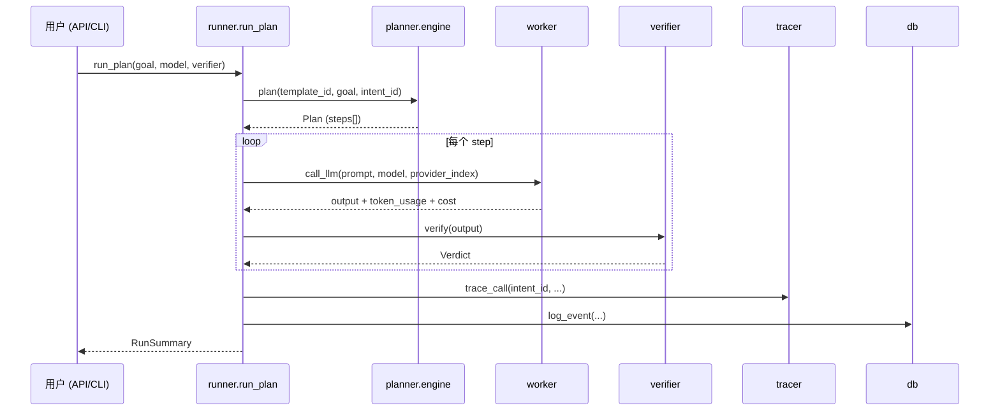

# llm-lab 架构文档（Architecture）

> 项目路径：`F:\TMLR\llm_lab`
> 测试命令：`cd F:\TMLR; $env:PYTHONPATH="F:\TMLR"; python -m pytest llm_lab -q`
> 当前测试状态：**349 passed / 1 skipped**；`ruff`（含 `S` 安全规则）与 `mypy` 均通过。

---

## 1. 概览

`llm-lab` 是一个 **local-first 的 LLM 评测（eval）管线**。它把「一个目标（goal）→ 一组可执行步骤（plan）→ 多步 LLM 调用 → 逐步验证（verify）→ 追踪（trace）→ 持久化（db）→ 导出报告（export）」封装成统一流程，同时提供 **FastAPI 服务**、**Typer CLI** 两种入口。

设计原则：

- **单编排、双入口**：`runner.py` 的同步编排逻辑被 API 与 CLI 共享，UI 只是薄壳。
- **可插拔三层**：Provider（LLM 供应商）、Verifier（校验器）、Template（步骤模板）均可扩展。
- **优雅降级**：DeepEval / Langfuse / tiktoken 均为可选依赖，缺失时回退到内置实现，服务不崩。
- **安全默认**：可选 API Key 鉴权、安全响应头、路径参数白名单校验、模板存储防路径穿越。

---

## 2. 目录结构

```
llm_lab/
├── __init__.py
├── main.py                # FastAPI 应用：路由 / 鉴权 / 安全头 / 路径校验
├── runner.py              # 同步编排核心（API 与 CLI 共享）
├── worker.py              # LLM 调用层（多供应商抽象）—— 注意没有根级 engine.py
├── verifier.py            # 校验器：Structural / Keyword / DeepEval
├── tracer.py              # 追踪：Langfuse + SQLite 回退
├── db.py                  # 持久化：aiosqlite（event_log + tasks 两表，WAL）
├── models.py              # Pydantic 数据契约
├── settings.py            # pydantic-settings 配置单一来源
├── pricing.py             # Token 计价（价格表 + 本地供应商免费）
├── export.py              # 导出：JSON / CSV / XLSX / HTML（全部转义）
├── promptfoo_provider.py  # Promptfoo 风格供应商（自带 SQLite 缓存 + 重试）
├── cli.py                 # Typer CLI：run / compare / serve / history / export / report / watch / diff
├── planner/               # 子包（注意：planner 是 package 不是单文件）
│   ├── __init__.py        # 再导出 plan / list_templates / save_custom_template ...
│   └── engine.py          # YAML 模板引擎 + 防路径穿越
│   ├── templates/         # 内置模板（builtin）
│   └── templates_custom/  # 用户自定义模板（运行时可写）
├── templates/             # 前端静态资源（index.html 等），由 main.py "/" 提供
└── tests/                 # 测试套件
```

> ⚠️ **易踩的坑**：早期用 `Get-ChildItem` 枚举根目录时，由于 `planner/` 是子包且还有同名 `templates/` 目录，根级 `engine.py` 看上去「存在」其实是 `planner/engine.py`。**LLM 调用层实际在 `worker.py`，不存在根级 `engine.py`**。

---

## 3. 分层与数据流

```
IntentRequest  ──►  main.py (FastAPI)  ──►  runner.run_plan()
                         │                        │
                    API 鉴权 / 安全头              ├─► planner.plan()       建步骤（YAML 模板）
                                                 ├─► worker.call_llm()    并发 LLM 调用（ThreadPoolExecutor）
                                                 ├─► verifier.Verify*     逐步校验（deepeval→structural 回退）
                                                 ├─► tracer.trace_call() Langfuse 或 SQLite
                                                 └─► db.log_event()       落库
                         │                        │
                    RunSummary / CompareResult ──► export.py (JSON/CSV/XLSX/HTML)
```

### 3.1 单次运行（`run_plan`）

`runner.py` 中的 `run_plan` 同时支持 API（`run_plan(request=...)`）与 CLI（`run_plan(goal, model, verifier)`）两种调用形态：

1. `pln.plan(template_id, goal, intent_id, settings, extra, structure_only)` 把目标展开成步骤列表（`Plan.steps`）。
2. 用 `concurrent.futures.ThreadPoolExecutor` 并发执行每一步：
   - 调用 `wrk.call_llm(provider_index=..., model=..., prompt=...)`
   - 用 `verifier.count_tokens` 累计 token
   - 用 `_resolve_verifier(verifier_name)` 解析校验器并执行验证
3. 汇总成 `RunSummary`（`steps_detail`、`all_passed`、`total_tokens`、`total_cost_usd` 等）。

`_resolve_verifier`：若 `DEFAULT_VERIFIER=deepeval` 但 `DEEPEVAL_ENABLED` 未开或 import 失败，则回退到 `structural`。即 **校验器不可用时永不阻塞主流程**。

### 3.2 A/B 对比（`run_compare`）

`run_compare(goal, model_a, model_b)`：在 `provider_index=0/1` 上各跑一遍 `run_plan`，产出 `CompareResult`（含 `model_a` / `model_b` 与 `summary.winner`、`cost_delta`、`token_delta`）。多模型通过 `LLM_API_KEY_2` / `LLM_BASE_URL_2` / `LLM_MODEL_2_OVERRIDE` 配置。

### 3.3 批量（`run_batch`）

`run_batch`：对一批 `IntentRequest` 用 `ThreadPoolExecutor` 并发调用 `run_plan`，返回 `BatchResult`。



---

## 4. 模块参考

### 4.1 `main.py` — FastAPI 入口

- **安全中间件**：注入 `X-Content-Type-Options`、`X-Frame-Options`、`Referrer-Policy`、`Content-Security-Policy` 等安全响应头（`/health`、`/promptfoo/health` 等豁免也无碍）。**刻意不设置** COOP/COEP，以支持跨源 LLM 端点。
- **鉴权**：可选 `LLM_LAB_API_KEY`。`api_key` 依赖用 `hmac.compare_digest` 做常量时间比较（修复了原计时比较漏洞）。未设置 `LLM_LAB_API_KEY` 时鉴权关闭，方便本地使用。
- **路径校验**：`_ID_RE = ^[A-Za-z0-9_-]{1,100}$`，`validate_path_param` 对 `{intent_id}` / `{template_id}` 做白名单校验，非法值返回 **422**（修复了原「任意路径穿越」漏洞）。
- **路由（共 10 个）**：

| 方法 | 路径 | 鉴权 | 说明 |
|---|---|---|---|
| GET | `/` | ❌ | 返回 `templates/index.html` 前端 |
| GET | `/health` | ❌ | `{"status":"ok"}` |
| GET | `/promptfoo/health` | ❌ | promptfoo 供应商健康检查 |
| POST | `/intent` | ✅ | 提交 `IntentRequest`，跑 `run_plan` |
| GET | `/runs` | ✅ | 查询 runs（支持 `intent_id` / `model` / `action` / `verdict` 过滤） |
| GET | `/runs/{intent_id}` | ✅ | 取某次运行事件 |
| GET | `/runs/{intent_id}/export/{fmt}` | ✅ | 导出 `json`/`csv`/`xlsx`/`html` |
| GET | `/templates` | ✅ | 列出模板 |
| POST | `/templates` | ✅ | 保存自定义模板 |
| DELETE | `/templates/{template_id}` | ✅ | 删除自定义模板 |
| POST | `/promptfoo/run` | ✅ | 经 promptfoo 供应商发起 LLM 调用 |

> 8 个路由需要鉴权，2 个健康检查不需要 —— 修复了原「所有核心端点未鉴权」+「`/health` 反而要求鉴权」的矛盾。

### 4.2 `runner.py` — 编排核心

- `run_plan(...)`：见 §3.1。
- `run_batch(intents, ...)`：并发编排多意图。
- `run_compare(goal, model_a, model_b)`：A/B 对比。
- 内部 `import`：`pln`（planner）、`wrk`（worker）、`dbe`（db）、`verifier as ver`、`tracer as tr`、`models`、`settings as st`、`pricing`。
- 关键设计：**同步逻辑 + `ThreadPoolExecutor` 并发**；DB 与追踪用异步（`await`），但编排热路径本身是同步的，降低死锁/事件循环复杂度。

### 4.3 `worker.py` — LLM 调用层（多供应商）

- `_build_client(provider_index)`：按 `LLM_PROVIDER` 构建客户端：
  - 本地供应商（`ollama`/`llamacpp`/`vllm`/`localai`/`tgi`）→ `OpenAI(base_url=..., api_key="ollama")`（OpenAI 兼容协议）
  - `anthropic` / `claude` → `Anthropic`
  - `gemini` / `google` → `google.generativeai`
  - 默认 → `OpenAI`
- `call_llm(provider_index=0, ...)`：组装 payload、选模型、发起调用、累计 token（本地供应商跳过 token 计数）、支持 promptfoo 重试。
- 多模型：`provider_index=1` 时读 `LLM_API_KEY_2` / `LLM_BASE_URL_2` / `LLM_MODEL_2_OVERRIDE`。
- 成本：`pricing.estimate_cost(model, prompt_tokens, completion_tokens)`。

> ✅ **可选依赖隔离**：`worker.py` 仅在顶层 `import openai`。`anthropic` 与 `google.generativeai` 均在 `_call_anthropic` / `_call_gemini` 内部以 `try: from anthropic import Anthropic` / `try: from google import genai` + `try: from google.genai import types` 的方式惰性导入，并由 `except ImportError` 返回结构化错误 dict。因此缺失这两个 SDK 时 `import llm_lab.worker` 不会失败；调用具体厂商时才报"SDK 未安装"。此模式与 `tracer.py` 对 `langfuse` 的处理一致。

### 4.4 `planner/engine.py` — 模板引擎

- `_TEMPLATE_ID_RE = ^[A-zA-Z0-9_-]+$`
- `_BUILTIN_DIR`（`planner/templates`，只读）与 `_CUSTOM_DIR`（`planner/templates_custom`，可写）。
- `_safe_template_path(name)`：先用正则校验 id；再用 `os.path.realpath` 确认落点在 `_CUSTOM_DIR` 之内 —— 双重防护防路径穿越（修复了原「任意文件读取/写入」漏洞）。
- `plan(template_id, goal, intent_id, settings, extra=None, structure_only=False)`：从模板展开步骤（`Step`），注入 `settings`、`model` 等。
- `list_templates()`：合并内置 + 自定义；`save_custom_template` / `delete_custom_template` / `reload_templates`：管理自定义模板。
- `planner/__init__.py` 再导出 `plan`、`get_template_def`、`list_templates`、`save_custom_template`、`delete_custom_template`、`reload_templates`、`_TEMPLATE_ID_RE`。

### 4.5 `verifier.py` — 校验器

- `count_tokens(text)`：优先 `tiktoken` 的 `cl100k_base`；缺失时回退 `len(text)/4` 启发式。
- `resolve_verifier(name, settings)`：DeepEval 用 `try/except` 包住，失败时回退 `structural`。
- 校验器族（均继承抽象 `BaseVerifier`）：
  - `StructuralVerifier`：检查 `.ok` 产物文件存在。
  - `KeywordVerifier`：关键词匹配输出。
  - `DeepEvalVerifier`：LLM-as-judge（G-Eval）。
- `_classify(text)`：用正则从文本抽取 `pass` / `fail` / `partial` 标签。

### 4.6 `tracer.py` — 追踪

- `_get_lf()`：仅当 `LANGFUSE_PUBLIC_KEY` 与 `LANGFUSE_SECRET_KEY` 同时存在时返回 Langfuse 客户端，否则 `None`。`langfuse` 为惰性 import（`try/except`），缺失不致命。
- `_ensure_trace(intent_id)`：每个 `intent_id` 复用同一 trace（缓存于 `_trace_cache`）。
- `trace_call(intent_id, action, model, prompt, output, metrics, verdict)`：有 Langfuse 走 Langfuse，否则落 SQLite（`db` 回退）。

### 4.7 `db.py` — 持久化

- `_DB_PATH`：`LLM_LAB_DB` 或默认 `llm_lab.db`。
- 异步 `aiosqlite`（事件循环外调用处用 `asyncio.run` 包一层，见 `cli.py`）。
- `init_db()`：
  - `CREATE TABLE IF NOT EXISTS event_log (...)`
  - `CREATE TABLE IF NOT EXISTS tasks (task_id, status, payload, ...)`
  - `PRAGMA journal_mode = WAL`
  - `ALTER TABLE event_log ADD COLUMN verdict TEXT`（幂等迁移，修复了原「verdict 无列」结构缺陷）
- 主要接口：`log_event`、`get_events(intent_id)`、`get_all_events(filters)`、`get_intents`、`list_intents`、`get_tasks`、`save_task`、`update_task`、`get_run_info`。
- `event_log` 列：`intent_id, seq, action, model, detail, token_usage, cost_usd, verdict, timestamp`（含响应哈希 `hashes`，修复了原「未留存产物哈希」的可审计性问题）。

### 4.8 `models.py` — 数据契约（Pydantic）

`IntentRequest`、`Verdict`、`CustomMetrics`、`Step`、`Plan`、`RunSummary`、`EventLogEntry`、`BatchRequest`、`TemplateDef`、`CompareResult`、`RunResult`、`BatchResult`。所有对外 JSON 经 Pydantic 序列化，类型稳定。

### 4.9 `settings.py` — 配置

`pydantic-settings` 单一来源，`env_file=.env`，`extra="ignore"`：

| 配置项 | 默认值 | 说明 |
|---|---|---|
| `LLM_PROVIDER` | `openai` | 主供应商 |
| `LLM_BASE_URL` | `https://api.openai.com/v1` | 主 base url |
| `LLM_MODEL` | `gpt-4o` | 主模型 |
| `LLM_MODEL_2` | `gpt-4o-mini` | 次模型名 |
| `LLM_API_KEY` | `""` | 主 key |
| `LLM_API_KEY_2` | `None` | 多模型次 key |
| `LLM_BASE_URL_2` | `None` | 多模型次 base url |
| `LLM_MODEL_2_OVERRIDE` | `None` | 次模型覆盖 |
| `ANTHROPIC_API_KEY` | `None` | Anthropic key |
| `GEMINI_API_KEY` | `None` | Gemini key |
| `DEEPEVAL_ENABLED` | `False` | 是否启用 DeepEval 校验 |
| `DEEPEVAL_MODEL` / `DEEPEVAL_THRESHOLD` | `None` / `0.5` | DeepEval 配置 |
| `PROMPTFOO_MAX_RETRIES` / `PROMPTFOO_BASE_DELAY` | `3` / `1.0` | promptfoo 重试 |
| `DEFAULT_VERIFIER` | `deepeval` | 默认校验器 |

- 便捷属性：`is_local` / `is_anthropic` / `is_gemini`；方法：`api_key_for(suffix)` / `base_url_for(suffix)`。
- `PRESETS`：`cheap` / `balanced` / `best` / `quick`；`resolve_preset(name)` 供 CLI `--preset` 使用。

### 4.10 `pricing.py` — 计价

- `_PRICE_PER_1K`：已知模型的 (输入价, 输出价) / 1K tokens。
- `_LOCAL_PROVIDERS`：本地供应商集合 → 成本恒为 `0.0`。
- `estimate_cost(model, prompt_tokens, completion_tokens)`：未知远程模型回退到 `$3 / 1M tokens`。

### 4.11 `export.py` — 导出

- `export_json` / `export_csv` / `export_xlsx`（需 `openpyxl`，缺失时抛清晰 `RuntimeError`）/ `export_html`。
- **所有 HTML 输出经 `_esc()` = `html.escape(str(v), quote=True)`**，杜绝 XSS（修复了原「HTML 报告反射型 XSS」漏洞）。

### 4.12 `promptfoo_provider.py` — Promptfoo 风格供应商

- **独立于 `worker.py` 的另一条 LLM 调用路径**：由 `POST /promptfoo/run` 与 `GET /promptfoo/health` 触发。
- 自带 SQLite 缓存（`PROMPTFOO_CACHE` 或 `.promptfoo_cache.db`），按 `sha256(model:::prompt)` 缓存命中。
- 读 `PROMPTFOO_CONFIG`（YAML）构建 OpenAI 兼容客户端。
- 重试：指数退避（`base_delay * 2^(attempt-1)`），最多 `PROMPTFOO_MAX_RETRIES` 次。

### 4.13 `cli.py` — Typer CLI

命令：`run`、`compare`、`serve`、`history`、`export`、`report`、`watch`、`diff`（`--version`）。基于 `typer` + `rich` 输出。

- `run`：单目标评测；`--preset` 解析 `PRESETS`；`--dry-run` 只打印不执行；结束后把结果 `trace_call` 落库，便于 `report`/`diff`/`history` 读取准确 verdict。
- `compare`：A/B 对比（见 §3.2）。
- `serve`：`uvicorn.run("llm_lab.main:app", ...)`，默认 `127.0.0.1:8123`。
- `history` / `export` / `report`：从 `db` 读取并渲染（`report` 生成 HTML，复用 `export.export_html`）。
- `watch`：轮询目录（`.py/.yaml/.yml/.md/.txt` 变化）后自动重跑 `run_plan`。
- `diff`：比较两个 `intent_id` 的 token / cost 差异。

---

## 5. 配置与环境变量汇总

| 变量 | 用途 |
|---|---|
| `LLM_PROVIDER` / `LLM_BASE_URL` / `LLM_MODEL` | 主供应商 / url / 模型 |
| `LLM_API_KEY` / `LLM_API_KEY_2` | 主 / 次 API key（多模型对比） |
| `LLM_BASE_URL_2` / `LLM_MODEL_2_OVERRIDE` | 次供应商 url / 模型覆盖 |
| `ANTHROPIC_API_KEY` / `GEMINI_API_KEY` | Anthropic / Gemini key |
| `DEEPEVAL_ENABLED` / `DEEPEVAL_MODEL` / `DEEPEVAL_THRESHOLD` | DeepEval 校验开关与阈值 |
| `DEFAULT_VERIFIER` | 默认校验器（`deepeval` / `structural` / `keyword`） |
| `PROMPTFOO_MAX_RETRIES` / `PROMPTFOO_BASE_DELAY` / `PROMPTFOO_CONFIG` / `PROMPTFOO_CACHE` | promptfoo 供应商重试/配置/缓存 |
| `LLM_LAB_API_KEY` | 可选 API 鉴权（未设则关闭） |
| `LLM_LAB_DB` | SQLite 数据库路径（默认 `llm_lab.db`） |
| `LANGFUSE_PUBLIC_KEY` / `LANGFUSE_SECRET_KEY` | Langfuse 追踪（同时设才启用） |

---

## 6. 扩展点

| 扩展目标 | 做法 |
|---|---|
| **新增 LLM 供应商** | 在 `Settings._LOCAL_PROVIDERS` 与 `worker._build_client` 加分支；在 `pricing._LOCAL_PROVIDERS` 标注免费；必要时在 `worker` 顶层 import 改为惰性 |
| **新增校验器** | 在 `verifier.py` 继承 `BaseVerifier`，并在 `resolve_verifier` 注册 |
| **新增/修改步骤模板** | 内置放 `planner/templates/*.yaml`；自定义经 `POST /templates` 或写 `planner/templates_custom/`（路径穿越安全） |
| **启用追踪** | 同时设置 `LANGFUSE_PUBLIC_KEY` / `LANGFUSE_SECRET_KEY`；否则自动 SQLite 回退 |
| **启用深度校验** | 安装 `deepeval` 并设置 `DEEPEVAL_ENABLED=true` |

---

## 7. 已修复的安全/质量缺陷（与架构相关）

这些修复已提交（`f31d0e4` `be72f17` `2e47df1` `1456178` `a709577`），并反映在上面的架构描述中：

1. **HTML 报告 XSS** → `export.py` 全部 `_esc()`。
2. **`intent_id` 未验证 + 任意路径穿越** → `main.py` `_ID_RE` + `validate_path_param` → 422。
3. **API Key 计时比较** → `hmac.compare_digest`。
4. **核心端点未鉴权 / `/health` 反需鉴权** → 8 端点鉴权、`/health`+`/promptfoo/health` 豁免。
5. **缺安全响应头** → 安全中间件注入。
6. **模板存储路径穿越** → `planner._safe_template_path` 双重防护。
7. **`event_log` 无 `verdict` 列** → `init_db` 幂等 `ALTER TABLE ... ADD COLUMN verdict`。
8. **未留存产物哈希** → `db.log_event` 写入 `hashes`，配合 `tracer`。

---

## 8. 测试与验证

- `llm_lab/tests/` 覆盖：`test_api`、`test_auth`、`test_cli`、`test_db`、`test_e2e_smoke`、`test_export`、`test_planner`、`test_promptfoo_provider`、`test_runner`、`test_settings`、`test_tracer`、`test_verifier`、`test_worker`。
- 运行：`cd F:\TMLR; $env:PYTHONPATH="F:\TMLR"; python -m pytest llm_lab -q` → **349 passed / 1 skipped**。
- 静态检查：`ruff`（含 `S` 安全规则）与 `mypy` 均通过。

---

## 9. 运维注意 / 后续可优化

1. ✅ **可选 SDK 隔离已就位**：`worker.py` 对 `anthropic` / `google.generativeai` 已采用惰性导入（见 §4.3），缺失时不会阻断模块加载。
2. **同步编排 + 异步 DB**：`cli.py` 多处用 `asyncio.run` 重新 `init_db()`，注意并发启动时的重复初始化；生产部署建议共享事件循环。SQLite 层已启用 `PRAGMA journal_mode=WAL` + `PRAGMA busy_timeout=5000`（见 §4.2），并发写入有等待超时，单机场景下安全；多机仍需迁移到 Postgres / 共享存储。
3. **`promptfoo_provider` 与 `worker` 两条 LLM 路径**：客户端构造已统一——`worker.build_openai_client(base_url, api_key)` 由两条路径共用，`promptfoo_provider._build_client_from_config` 与 `worker._build_client` 均委托给它。配置来源（`PROMPTFOO_CONFIG` vs `LLM_*`）仍按设计保持独立（promptfoo 是"另一条语义不同的链路"），调用语义（缓存、重试、token 计量）属有意识的差异化，不进一步合并。
